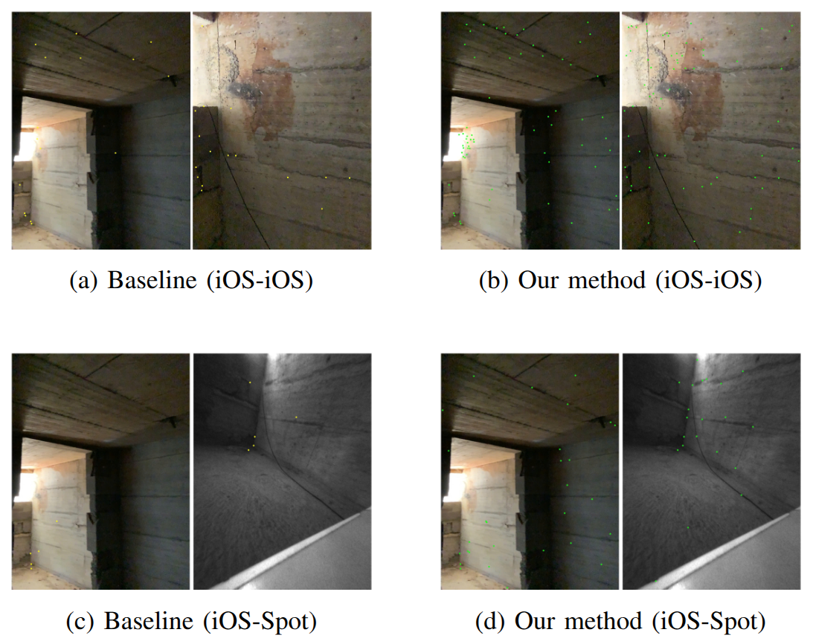
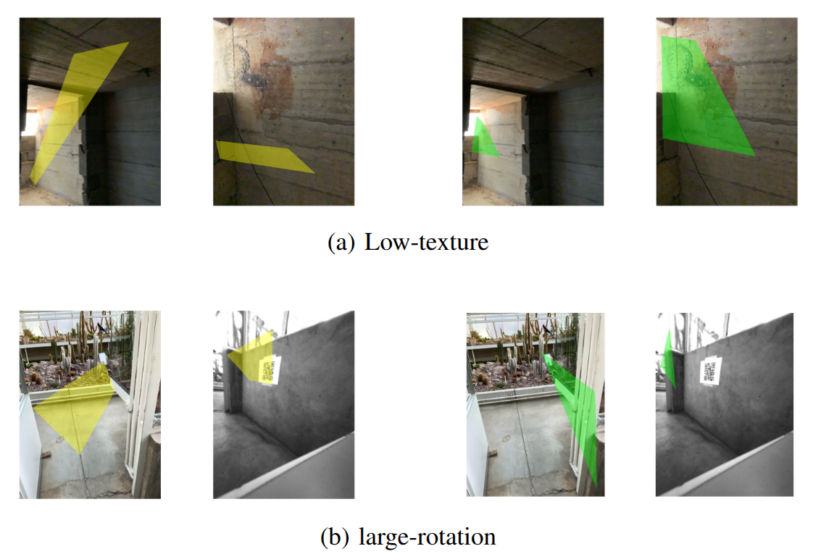
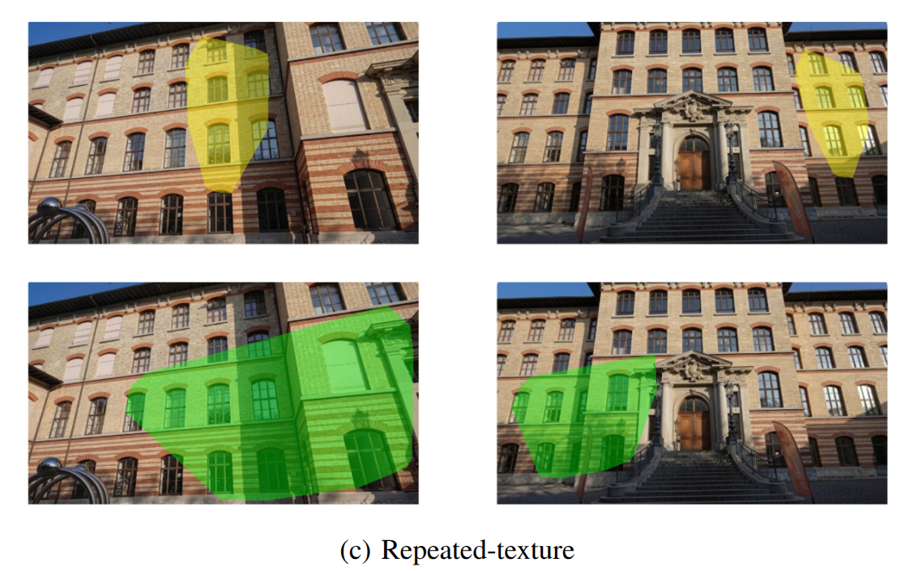

# Dense Match Augmentation for Visual Localization 📍

## 📖 Overview
Visual localization is a fundamental problem in robotics and computer vision, especially challenging under large viewpoint changes, low-texture surfaces, and perceptual aliasing. 

While modern hierarchical localization pipelines (like HLoc) using sparse features (e.g., SuperPoint + LightGlue) show strong performance, they often become fragile when image overlap is small or distinct keypoints are missing.

**Our Solution:** We propose a **dense match augmentation framework** that integrates RoMa correspondences into an HLoc-style sparse localization pipeline. Instead of completely replacing sparse matching, we utilize dense matching to refine existing matches, add missing keypoints, and resolve ambiguous regions through a novel **global-to-local surface patch matching strategy**.

## 🔑 Key Contributions
* **Framework Integration:** Seamlessly integrates RoMa dense correspondences into the HLoc-style sparse localization pipeline.
* **Match Enhancement:** Refines SuperPoint–LightGlue matches, injects missing keypoints, and supports multi-point correspondences to significantly improve matching coverage.
* **Surface-Patch-Matching:** Introduces a dual-level matching strategy (global and local) to recover correspondences often overlooked in repetitive or symmetric scenes.
* **Robustness:** Achieves state-of-the-art robustness in challenging cross-device and cross-view scenarios.

---

## 📊 Quantitative Results

Our framework was evaluated on the challenging cross-device and cross-view scenarios of the **CroCoDL dataset**, using SuperPoint + LightGlue as the strong baseline. 

*(Localization accuracy is reported under the 0.5 m/5° threshold).*

### Ablation Study
We analyzed the impact of different dense matching strategies on the Succulent Plant Collection (iOS Query–Spot Map setting).

| Method | Dense Matcher | Accuracy (%) |
| :--- | :---: | :---: |
| SuperPoint + LightGlue baseline | - | 58.73 |
| Dense match refinement | RoMa | 60.58 |
| Dense match expansion | RoMa | 65.74 |
| Global-to-local patch-wise dense matching | DKM | 62.30 |
| Global-to-local patch-wise dense matching | LoFTR | 57.8 |
| **Global-to-local patch-wise dense matching** | **RoMa** | **70.37** |

### Cross-Device Localization Accuracy
Overall performance comparison across different query and map device scenarios.

| Scenario | Baseline (%) | Ours (%) | Gain (pp) |
| :--- | :---: | :---: | :---: |
| iOS Query – HL Map | 74.74 | **79.63** | +4.89 |
| iOS Query – Spot Map | 58.73 | **70.37** | +11.64 |
| HL Query – Spot Map | 67.35 | **76.11** | +8.76 |

---

## 🖼️ Qualitative Results

Our method significantly increases the number and spatial coverage of reliable keypoints, providing stronger geometric constraints for more accurate pose estimation, particularly in challenging environments.

### 1. Low-Texture Environments
Compared to the baseline, our dense match augmentation successfully recovers structural keypoints on plain surfaces.

*Fig 1. Keypoint comparison in a low-texture environment. (a, c) SuperPoint+LightGlue baseline. (b, d) Our method.*

*Fig 2. Matching plane comparison in a low-texture, large rotation environment. (a. left) SuperPoint+LightGlue baseline. (a. right) Our method. (b. left) SuperPoint+LightGlue baseline. (b. right) Our method*

### 2. Repetitive Structures
By restricting dense matching to smaller local regions, our method reduces reliance on globally dominant repeated patterns and recovers matches on locally distinctive structures.

  

*Fig 3. Visualization of geometric constraints in highly repetitive building facades.*

---
**Project Repository:** [Click here to access the private repository](https://github.com/VuThanhDat14122004/Dense_augmentation_matching)
*(Note: Access is restricted to authorized personnel only.)*
